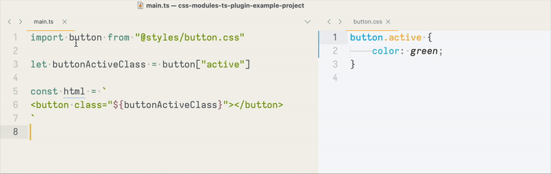

# css-modules-ts-plugin



This plugin aims to provide a basic LSP support for CSS modules that _should be_ compatible with TypeScript 5 and composite projects.

1. `npm install --save-dev css-modules-ts-plugin`
2. Add this to your tsconfig.json:

```jsonc
{
    "compilerOptions": {
        // ... other compiler options ...

        "rootDir": "./", // make sure rootDir is set!
        "plugins": [{
            "name": "css-modules-ts-plugin"
        }]
    }
}
```

3. Reload your LSP
